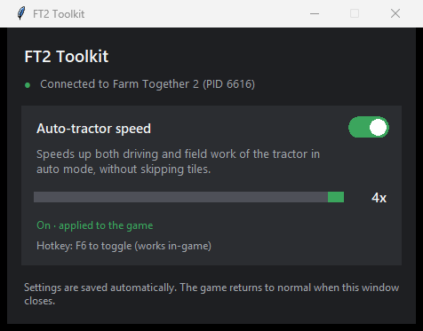

# FT2 Toolkit

A small, open-source helper for **Farm Together 2**. It currently lets you speed up the auto-tractor
from 1x to 4x, with an on/off toggle, a live speed slider, and an **F6** hotkey that works while you play.



- **No exe, no installer, no dependencies.** Pure Python using only the standard library (`tkinter`, `ctypes`).
  The code you run is exactly the `.py` files in this repository.
- **Game files are never modified.** Changes live only in the running game's memory and are undone when
  the toolkit or the game closes.
- **No network access, no admin rights.**

> ⚠️ For **single-player** use only. This is an unofficial tool and is not affiliated with Milkstone Studios.
> Use at your own risk.

## Features

| Feature | Description |
|---|---|
| Auto-tractor speed | Multiplies both the driving speed and the field-work rate of the tractor in auto mode (1x–4x). Both are scaled together, so no tiles are skipped. |

General behavior:

- Finds the game automatically. If the toolkit starts first, it waits; if the game restarts, settings are re-applied.
- Settings are stored in `%APPDATA%\FT2Toolkit\settings.json`.
- **F6** toggles the tractor speed, even in full screen (a short sound confirms it).

## Getting started

1. Install **Python 3.9+ (64-bit)** from <https://www.python.org/downloads/>. The default install already includes `tkinter`.
2. Download this repository (**Code → Download ZIP** and extract it, or `git clone`).
3. Start Farm Together 2, then double-click **`FT2Toolkit.pyw`**.

To run it from a terminal instead:

```
python -m ft2_toolkit
```

There is nothing to `pip install`.

## How it works

The game is built with Unity (IL2CPP), so its logic is compiled machine code inside `GameAssembly.dll`.
The auto-tractor speed is computed in `LocalPlayer.Update` (the `Player.PlayerState.AutoTractor` branch):

```
target           = GameGlobals.Game.TractorWorkSpeed(level)        // ... * 2.5
autoTractorSpeed = Min(SmoothDamp(..., target), 3.75)              // TractorWorkSpeed_Max
work interval    = Max(0.176, TractorWorkInterval(level, ...))     // 0.22 (0.25 in legacy mode)
```

The toolkit redirects the six instructions that load these constants to scaled copies: speed and speed cap
are **multiplied**, work intervals are **divided** by the chosen multiplier. The copies are written to unused
padding at the end of `GameAssembly.dll`'s code section (RVA `0x1C01F00`). `TractorWorkSpeed` and
`TractorWorkInterval` are only called from `LocalPlayer.Update`, so nothing else in the game is affected.

| Instruction RVA | Instruction | Original constant (RVA) | Scaling |
|---|---|---|---|
| `0x35D1CB` | `mulss xmm0, [rip+disp32]` | 2.5 (`0x1C02DB4`) | × multiplier |
| `0x7AE97A` | `movss xmm8, [rip+disp32]` | 3.75 (`0x1C03648`) | × multiplier |
| `0x7AE999` | `movss xmm8, [rip+disp32]` | 3.75 (`0x1C03648`) | × multiplier |
| `0x7AEDDB` | `movss xmm0, [rip+disp32]` | 0.176 (`0x1C03644`) | ÷ multiplier |
| `0x35D015` | `movss xmm0, [rip+disp32]` | 0.22 (`0x1C02E5C`) | ÷ multiplier |
| `0x35D065` | `movss xmm0, [rip+disp32]` | 0.25 (`0x1C02D10`) | ÷ multiplier |

Safety checks:

- Before writing, every instruction's bytes are compared with the expected ones. If a game update changed the
  code, the toolkit **writes nothing** and shows an "Unsupported game version" error on the card.
- If the padding area contains anything unexpected, it is left untouched.
- The game has a speed check for multiplayer sessions (`Player.CheckWorkThrottle`). It is inactive in
  single-player; do not use the toolkit while playing with others.

### Project layout

| File | Contents |
|---|---|
| `ft2_toolkit/win32.py` | `ctypes` declarations of the Windows API functions used |
| `ft2_toolkit/game.py` | Finding the game process, reading and writing its memory |
| `ft2_toolkit/features/base.py` | Base class for features that can be switched on and off |
| `ft2_toolkit/features/tractor_speed.py` | Auto-tractor speed: addresses, verification, patching |
| `ft2_toolkit/ui.py` | `tkinter` user interface |
| `ft2_toolkit/hotkey.py` | Global F6 hotkey |
| `ft2_toolkit/settings.py` | Settings file |

## Supported game version

Steam release, `build-guid 902a06628739481fa9a998436c48d8db` (Unity 2022.3.62f2).
After a game update the addresses may need to be found again. They were located with
[Il2CppDumper](https://github.com/Perfare/Il2CppDumper) (`dump.cs`) and a disassembler, using the method and
constant names listed above.

## Adding a feature

1. Create a subclass of `Feature` in `ft2_toolkit/features/` and implement `verify` (can this game version be
   patched?), `apply` and `revert`. `apply` and `revert` must be safe to call repeatedly.
2. Add it to `create_all()` in `ft2_toolkit/features/__init__.py`.

The card, toggle and settings persistence are created automatically. Override `build_options` to add extra
controls such as a slider.

## License

[MIT](LICENSE)
